<h1 align="center">CommitT</h1>
<p align="center">
  
</p>

<p align="center">
A strict, native Android accountability enforcer with real penalties
</p>

<p align="center">
<a href="https://committ.mintlify.app">Documentation</a>
</p>

<p align="center">
  <a href="https://www.youtube.com/watch?v=bRXWSDxBWDg" target="_blank">
    
  </a>
</p>

## App Previews

<details>
  <summary>📸 Click to expand the full 19-screen step-by-step walkthrough</summary>
  <br/>
  
  ### 📱 Phase 1: Authentication & Main Dashboard
  <table>
    <tr>
      <td align="center" width="25%"><b>Dashboard / Active Commits</b><br/>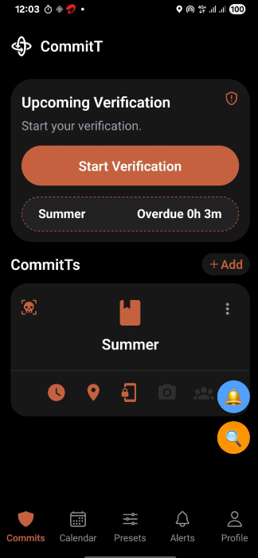</td>
      <td align="center" width="25%"><b>Onboarding / Details</b><br/>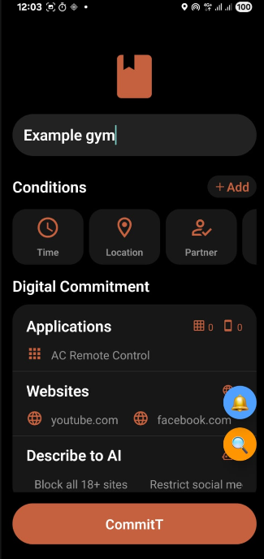</td>
      <td align="center" width="25%"><b>Task Statistics</b><br/>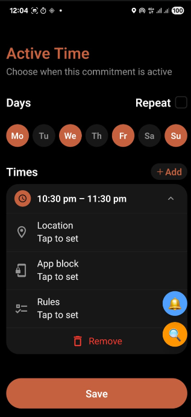</td>
      <td align="center" width="25%"><b>Profile & Session History</b><br/>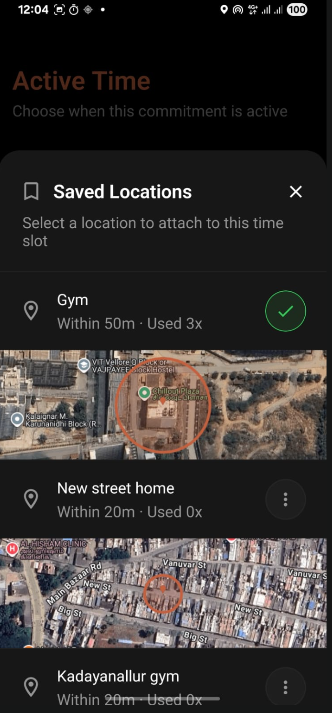</td>
    </tr>
  </table>

  ### ⚙️ Phase 2: Preset Selection & Configuration
  <table>
    <tr>
      <td align="center" width="25%"><b>Choose Category</b><br/>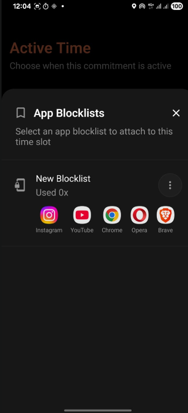</td>
      <td align="center" width="25%"><b>Commitment Presets</b><br/>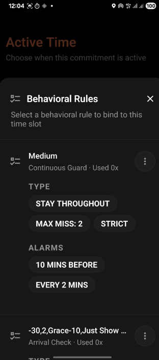</td>
      <td align="center" width="25%"><b>Custom App Blocklist</b><br/>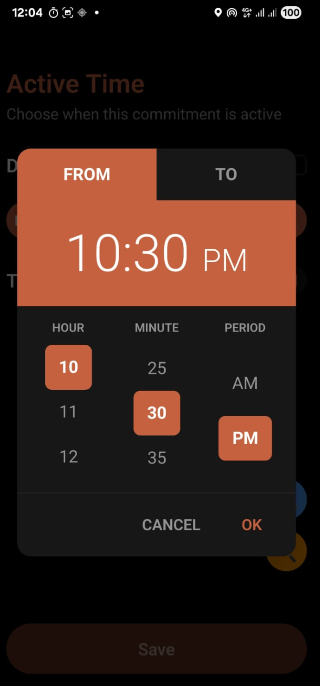</td>
      <td align="center" width="25%"><b>Blocklist Customization</b><br/>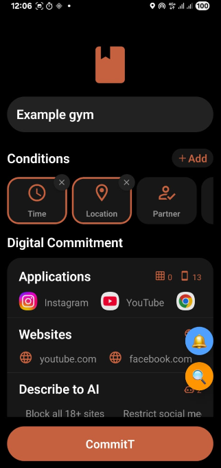</td>
    </tr>
  </table>

  ### 📍 Phase 3: Time & Location Bounds
  <table>
    <tr>
      <td align="center" width="25%"><b>Schedule Time Setup</b><br/>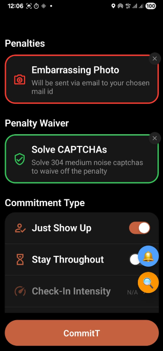</td>
      <td align="center" width="25%"><b>Active Window Picker</b><br/>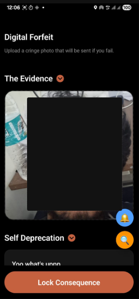</td>
      <td align="center" width="25%"><b>Location Fencing Map</b><br/>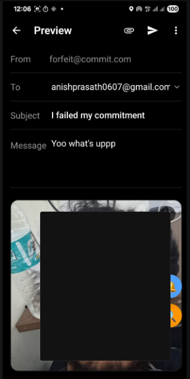</td>
      <td align="center" width="25%"><b>Geofencing Radius Picker</b><br/>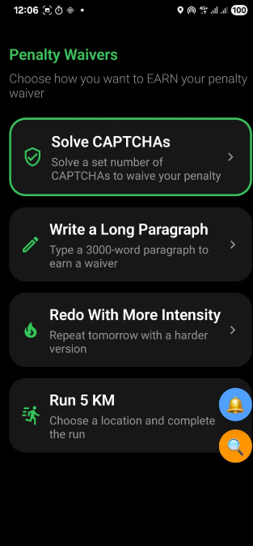</td>
    </tr>
  </table>

  ### 🔒 Phase 4: Penalty & Waiver Settings
  <table>
    <tr>
      <td align="center" width="25%"><b>Stake Penalty Setup</b><br/>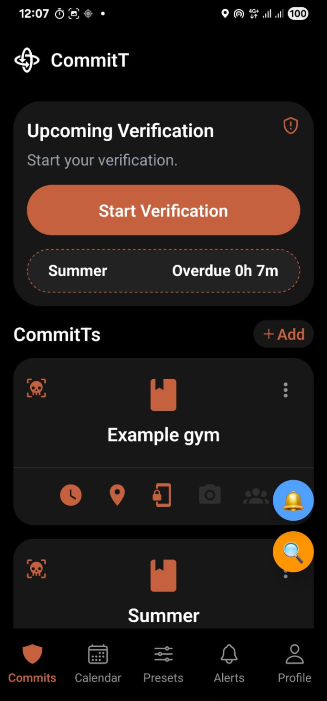</td>
      <td align="center" width="25%"><b>CAPTCHA Anti-Bypass</b><br/>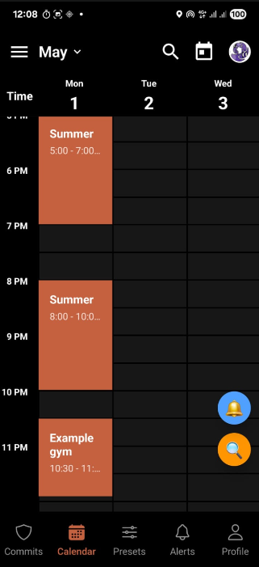</td>
      <td align="center" width="25%"><b>Verification Interval Settings</b><br/>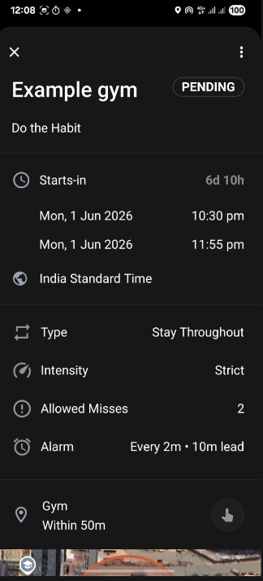</td>
      <td align="center" width="25%"><b>Waiver Challenge Customization</b><br/>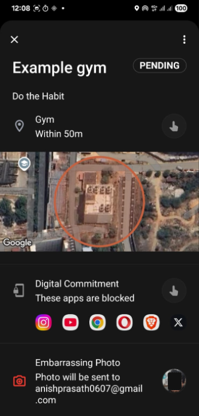</td>
    </tr>
  </table>

  ### 🚨 Phase 5: Final Review & Enforcement
  <table>
    <tr>
      <td align="center" width="25%"><b>Wizard Review (Final Step)</b><br/>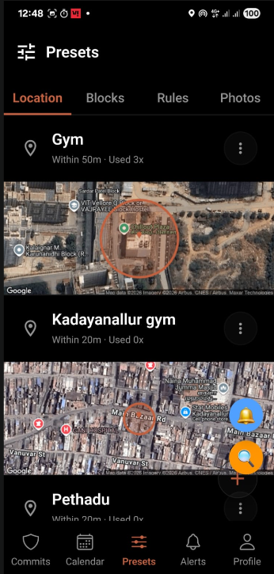</td>
      <td align="center" width="25%"><b>Active Lockscreen Blocker</b><br/>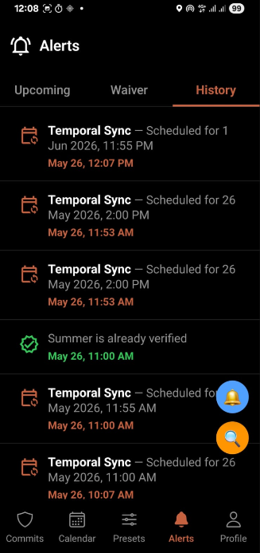</td>
      <td align="center" width="25%"><b>Penalty Execution Logging</b><br/>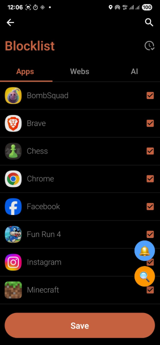</td>
      <td align="center" width="25%">-</td>
    </tr>
  </table>
</details>

## Why CommitT?

Most accountability apps rely on willpower. CommitT doesn't. It hooks directly into the Android operating system — blocking apps, locking settings, and enforcing real penalties when you break your commitments. No loopholes.

- **Automatic app blocking** — Instagram, YouTube, Games, etc. get hard-blocked during active sessions
- **Settings lockout** — you cannot access device Settings or disable blocks mid-session
- **Time + Location enforcement** — commitments activate based on when and where you are
- **Random check-ins** — photo and GPS verification at unpredictable intervals to prove you stayed
- **Multiple difficulty levels** — choose how strict the enforcement should be
- **Real penalties** — money stakes, embarrassing photos sent to friends, or CAPTCHA walls
- **Immutable commitments** — once a session starts, you cannot edit or delete it
- **Penalty waivers** — fail a commitment? Complete redemption challenges before the deadline or the penalty fires automatically
- **Smart alarms** — staggered pre-alarms, session start, random checkpoint pings, and end-of-window notifications

## How It Works

CommitT uses a **Triple-Write Protocol** to synchronize commitments across three isolated environments:

1. **Cloud First (Convex Backend)** — The remote mutation is attempted first. If it fails (e.g., no network), the entire operation halts with a clean error. The cloud is the source of truth.
2. **Local Cache (Expo SQLite)** — On cloud success, a raw SQL transaction writes the task and all generated instances to the on-device database. This powers instant UI re-renders without a network round-trip.
3. **Native OS (Kotlin AlarmScheduler)** — Finally, `scheduleNextAlarm()` fires across the React Native JSI bridge. The Kotlin module reads SQLite state and binds WakeLock-backed PendingIntents to the hardware alarm clock.

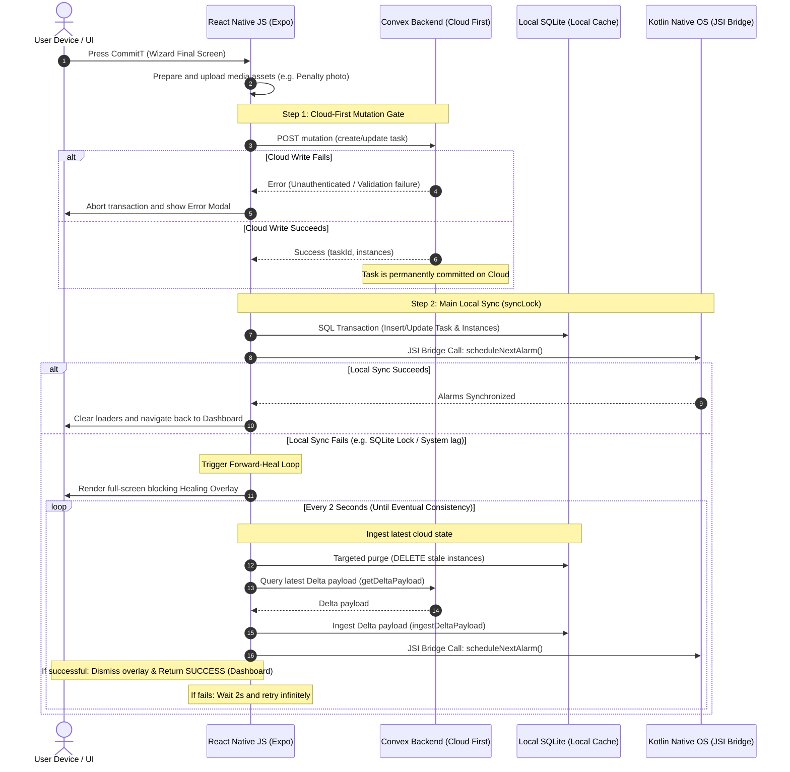

Each layer is gated behind the previous. If the Cloud Write fails, the operation terminates cleanly. However, once the Cloud confirmation is received, the operation is considered globally successful. If a subsequent local write fails, instead of reverting the cloud (Saga rollback), CommitT executes an infinite **Forward-Heal Loop** to pull the latest Convex Delta payload and ingest it into SQLite, ensuring eventual local consistency without split-brain anomalies.

## Vision

**Enforcement over motivation.** Willpower fades after two weeks. CommitT physically prevents quitting.

**Cloud-first, locally resilient.** The source of truth lives in Convex. But once synced, enforcement runs entirely on-device via SQLite and native Kotlin services — surviving network drops, app restarts, and phone reboots.

**Security through depth.** Three layers of Android system integration (Accessibility Service, WindowManager overlays, AlarmManager + WakeLocks) make circumvention extremely difficult. The anti-bypass heuristics remain closed-source by design.

## Tech Stack

| Layer | Technology |
|---|---|
| **Mobile Core** | React Native, Expo, TypeScript, Reanimated, Zustand |
| **Native Android** | Kotlin, Accessibility Service, WindowManager, AlarmManager, WakeLocks |
| **Location Tracking**| Android LocationManager (1Hz Live GPS), FusedLocationProviderClient, Google Maps/Places APIs |
| **Backend** | Convex (real-time sync + serverless mutations), domain-driven crons |
| **Local DB** | SQLite via Expo SQLite (WAL journaling, mutex-locked writes, Nuke & Pave migrations) |
| **Auth & Security** | Better Auth (Email/OAuth), JailMonkey (Root/Jailbreak Detection) |
| **Styling & UI** | TailwindCSS v4, Uniwind, HeroUI Native, Gorhom Bottom Sheets |
| **Validation & Data**| Zod (Runtime Schemas), OpenCode AI SDK |
| **Monorepo** | Turborepo, Bun |
| **Desktop / Browser**| Tauri + Vite + React, WXT (Browser Extension Framework) |

## Architecture

```
apps/
├── native/                    # React Native + Expo mobile client
│   ├── app/                   # Screens and routing
│   │   ├── (main)/            # Dashboard, commits list, presets
│   │   ├── (create-commit)/   # Multi-step commitment creation wizard
│   │   ├── (auth)/            # Authentication and session management
│   │   ├── (penalties)/       # Penalty configuration screens
│   │   └── (settings)/        # Permissions audit, preferences
│   ├── lib/                   # Core infrastructure
│   │   ├── triple-write-orchestrator.ts   # Cloud → SQLite → Kotlin saga
│   │   ├── sync-engine.ts     # Offline sync and write-gate queue
│   │   ├── local-db.ts        # Nuke & Pave schema management
│   │   ├── sync-lock.ts       # Cross-thread mutex locks
│   │   ├── local-db-commits.ts# Specialized SQLite transaction boundaries
│   │   └── validation/        # Task constraint validation (timeSlot.ts, taskDraft.ts)
│   ├── modules/               # Native Kotlin bridges (JSI)
│   │   ├── scheduler-module/  # AlarmManager + WakeLock orchestration
│   │   │   ├── AlarmScheduler.kt # Binds SQLite state to Android Alarm Clock
│   │   │   ├── BootReceiver.kt   # Re-hydrates state on device restart (FBE bypass)
│   │   │   └── SchedulerModule.kt# JSI bindings for JS layer
│   │   ├── blocker-module/    # [CLOSED SOURCE] Anti-circumvention engine
│   │   ├── app-lister-module/ # JSI-powered package enumeration
│   │   │   └── AppListerModule.kt # High-speed extraction of installed packages
│   │   ├── recovery-module/   # Self-healing connection recovery
│   │   │   └── RecoveryModule.kt # Monitors and resurrects dead websockets
│   │   └── logcat-module/     # Native logging bridge
│   │       └── LogcatRecorder.kt # In-memory buffer for bridging native logs to JS
│   ├── components/            # UI components and design tokens
│   ├── providers/             # Resurrection provider, hydration engine
│   ├── stores/                # Zustand state machines
│   └── plugins/               # Expo config plugins (AndroidManifest AST patches)
├── web/                       # Tauri desktop dashboard
├── extension/                 # Browser distraction blocker (WXT)
└── BugReport/                 # Forensic engineering case studies

packages/
├── backend/convex/            # Convex cloud backend (Domain-Driven Design)
│   ├── api/                   # Presentation Layer: Public mutation/query handlers
│   │   ├── commitments/       # Client interfaces for commitment creation
│   │   ├── instances/         # Session instance controllers
│   │   ├── notifications/     # Outbound webhook & push routing
│   │   ├── security/          # Auth and permission boundaries
│   │   └── sync/              # Client-to-cloud synchronization endpoints
│   ├── config/                # Environment, constants, and enums
│   ├── core/                  # Domain Layer: Pure Business Logic
│   │   ├── commitments/       # Commitment lifecycle rules
│   │   ├── enforcement/       # Restriction and hardware lock logic
│   │   ├── instances/         # State machine for active sessions
│   │   ├── penalties/         # Accountability calculation rules
│   │   ├── verification/      # Cryptographic & GPS validation rules
│   │   └── waivers/           # Redemption and waiver rules
│   ├── db/                    # Data Access Layer
│   │   └── schema.ts          # 500+ line typed schema with immutable lock zones
│   ├── execution/             # Application Layer: Background jobs & scheduling
│   │   ├── penalties/         # Async workers for Stripe/Resend execution
│   │   ├── scheduling/        # State transitions and cron orchestrators
│   │   ├── verification/      # Async condition validation workers
│   │   └── watchdog.ts        # Background cron that identifies orphaned tasks
│   ├── lib/                   # Shared utilities (logger, errorHandling, validators)
│   └── crons.ts               # Hourly self-healing scheduler registration
└── docs/                      # Architecture and philosophy documentation
```

## Engineering Highlights

- **SQLite WAL Contention Resolution** — Diagnosed and fixed a production database corruption caused by competing WAL writer locks between the Kotlin native layer and Expo SQLite JS runtime. Full forensic writeup in `apps/BugReport/SyncBug.txt`.
- **82% Android Memory Reduction** — Resolved a `java.lang.OutOfMemoryError` (124MB allocation) in the scheduler module by implementing data-size constraints and connection lifecycle management.
- **Boot-Resilient Alarm Architecture** — Dual-storage system ("Vault" + "Sticky Note") ensures alarms survive phone reboots even before the user enters their PIN, using Android's Device Protected Storage (FBE bypass).
- **Self-Healing Watchdog** — Backend cron that automatically detects and reschedules orphaned task instances every hour.

## Documentation

- **Official Documentation**: [committ.mintlify.app](https://committ.mintlify.app) — Production-level user guides, feature documentation, and configuration references.
- **Engineering Logs & Architecture Notes**: [Daily Logging Journey](https://committ.mintlify.app/2025/december/day-05) — A deep-dive personal development diary detailing how the architecture was built, the technical challenges faced, and the solutions implemented.

## Security Notice

To prevent bypass abuse, the core Kotlin anti-circumvention heuristics and penalty execution engines remain closed-source. This repository contains the public-facing architecture, native bridges, and synchronization layer.

## Acknowledgements

<table>
  <tr>
    <td align="center"><a href="https://reactnative.dev/"></a></td>
    <td align="center"><a href="https://convex.dev"></a></td>
    <td align="center"><a href="https://expo.dev"></a></td>
    <td align="center"><a href="https://docs.swmansion.com/react-native-reanimated/"></a></td>
    <td align="center"><a href="https://wxt.dev"></a></td>
    <td align="center"><a href="https://better-auth.com/"></a></td>
  </tr>
  <tr>
    <td align="center"><a href="https://reactnative.dev/"><b>React Native</b></a><br>Core Mobile Layer</td>
    <td align="center"><a href="https://convex.dev"><b>Convex</b></a><br>Serverless Backend</td>
    <td align="center"><a href="https://expo.dev"><b>Expo</b></a><br>Native Framework</td>
    <td align="center"><a href="https://docs.swmansion.com/react-native-reanimated/"><b>Reanimated</b></a><br>60fps Animations</td>
    <td align="center"><a href="https://wxt.dev"><b>WXT</b></a><br>Extension Engine</td>
    <td align="center"><a href="https://better-auth.com/"><b>Better Auth</b></a><br>Authentication</td>
  </tr>
</table>

## License

CommitT is licensed under the GNU Affero General Public License v3.0 (AGPL-3.0).

This ensures that any modified versions deployed as a service must also remain open-source under the same license.

Commercial licensing may be available in the future for organizations seeking proprietary usage rights.
